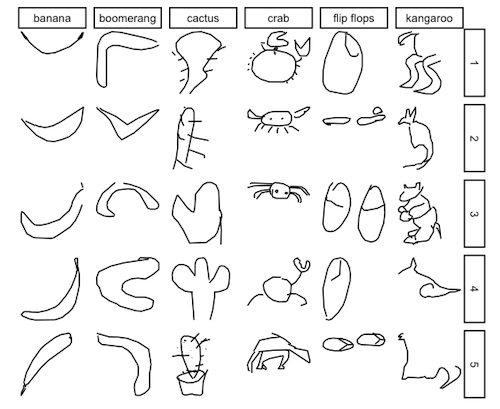

```{r setup, include=FALSE}
knitr::opts_chunk$set(echo = FALSE)
library(tidyverse)
```

```{r titleslide, child="components/titleslide.Rmd"}
```

---
# Kaggle result

MAKE SOME SUMMARY OF HOW YOUR TEAM'S MODELS PERFORMED


---
# Approach

__How did you tackle the problem__ 
--

1. First step was to submit predictions using Random Forest code provided 
--

2. ...
--

3. ...


---
# Model Overview


OUR BEST MODEL WAS ...


---
# Model Details

ARE THERE SPECIFIC THINGS ABOUT YOUR MODEL THAT THE AUDIENCE SHOULD KNOW

---
# Interesting observations

WERE ANY OBSERVATIONS IN THE TRAINING SET DIFFICULT TO CLASSIFY?

WERE SOME OBJECTS MORE OFTEN CONFUSED WITH OTHER OBJECTS?

---
Include an image using: 



---

or you can use this to include an image:


---
# Concluding statements

WHAT WOULD YOU DO DIFFERENTLY NEXT TIME OR WHAT WORKED WELL AND WHAT WAS DIFFICULT


---
```{r endslide, child="components/endslide.Rmd"}
```


